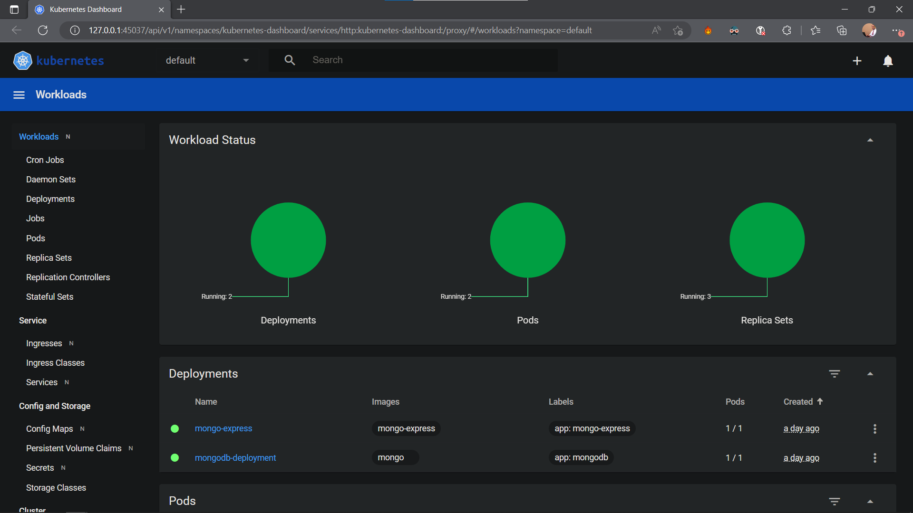
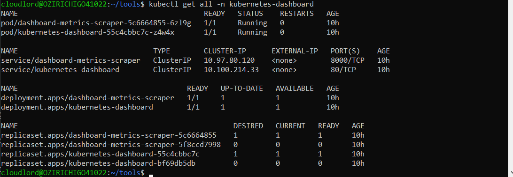

# What I Learned Today
This file will be a compilation of some of the things I pick up during my learning journey.
## (16/07/2023) 
### How I made microsoft-edge my default web browser on my ubuntu 20.04 app
So, I was trying to start a minikube cluster on my local machine and my default browser would not open up automatically. After searching on the internet, I found the following solution. To set microsoft edge as the default web browser of your ubuntu 20.04 app, run the following commands on your ubuntu terminal:
```
sudo apt install xdg-utils -y
xdg-settings set default-web-browser microsoft-edge.desktop
```
With this successfully executed, any time I run a command that should open up my browser automatically, my microsoft-edge browser opens up at the prompt.

### How I installed kubectl on ubuntu 20.04
Following an answer on [StackOverflow](https://stackoverflow.com/questions/69070582/how-can-i-install-kubectx-on-ubuntu-linux-20-04), I added the following lines to my `/etc/apt/sources.list` file:
```
# for kubectx
deb [trusted=yes] http://ftp.de.debian.org/debian buster main
```
Then update apt and install kubectx:
```
sudo apt update
sudo apt install kubectx -y
```
With kubectx, you also get `kubens` for running commands pertaining to kubernetes namespace.

### How I created the kubernetes-dashboard namespace on my Ubuntu 20.04 app
Finding the kubernetes-dashboard namespace absent in my minikube, I learned I had to create it myself (as opposed to a macOs user who may have it by default) using the following commands:
```
kubectl create namespace kubernetes-dashboard
kubectl apply -f https://raw.githubusercontent.com/kubernetes/dashboard/v2.0.0/aio/deploy/recommended.yaml
```
First, I created the kubernetes-dashboard namespace. Then I applied the recommended configuration file from the kubernetes github repository. Also, to enable the metrics server on your dashboard, run `minikube addons enable metrics-server`.
After running `minikube dashboard`, you should have something similar to the snapshot below:



Also, when you run `kubectl get all -n kubernetes-dashboard`, you should get something similar to this on the terminal:



